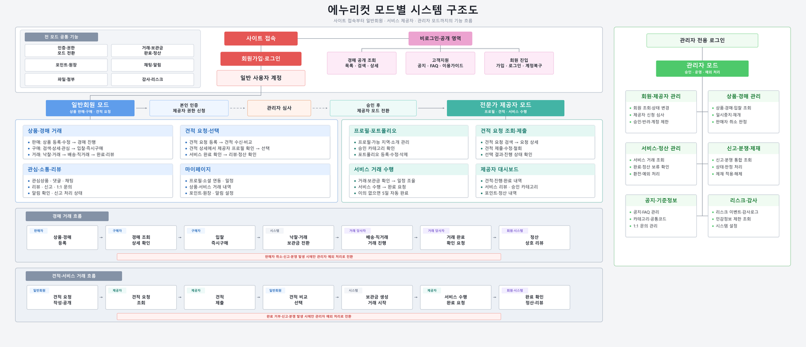
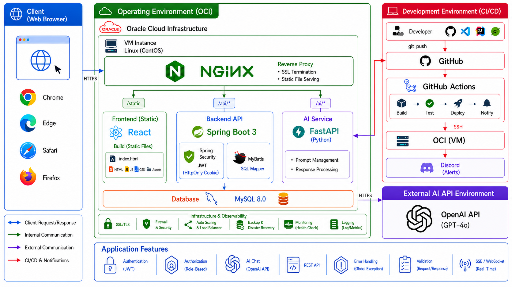

# 에누리컷(NCT) — Frontend

> 7인 팀 프로젝트 · 중고 물품 경매와 생활 서비스 견적 비교를 하나의 거래 흐름으로 연결한 플랫폼
> 배포: [https://negocut.store](https://negocut.store)

에누리컷은 사용자가 중고 물품을 경매로 거래하고, 이사·청소·설치/수리·인테리어·레슨 등의 생활 서비스를 요청해 여러 제공자의 견적을 비교할 수 있는 웹 서비스입니다. 일반 회원, 서비스 제공자, 운영 관리자에게 필요한 화면을 역할별로 제공합니다.



## 목차

1. [프로젝트 소개](#프로젝트-소개)
2. [기술 스택](#기술-스택)
3. [화면 구성](#화면-구성)
4. [주요 기능](#주요-기능)
5. [프로젝트 구조](#프로젝트-구조)
6. [로컬 실행](#로컬-실행)
7. [관련 저장소](#관련-저장소)

## 프로젝트 소개

| 구분 | 내용 |
|---|---|
| 프로젝트명 | 에누리컷(NCT) |
| 개발 형태 | 프론트엔드·백엔드 분리형 7인 팀 프로젝트 |
| 주요 사용자 | 비회원, 일반 회원, 서비스 제공자, 관리자 |
| 핵심 도메인 | 인증, 물품 경매, 서비스 요청·견적, 거래, 포인트, 정산, 운영 관리 |
| 운영 주소 | [negocut.store](https://negocut.store) |

## 기술 스택

| 분류 | 기술 |
|---|---|
| Core | React 19, JavaScript |
| Build | Vite 8 |
| Routing | React Router DOM 7 |
| Server State | TanStack Query 5 |
| HTTP | Axios |
| Styling | Tailwind CSS 4 |
| UI / UX | SweetAlert2, Lucide React, AOS, React Loading Skeleton |
| Security | DOMPurify |
| External UI | Daum 우편번호, TossPayments SDK |
| Quality | ESLint |



## 화면 구성

| 영역 | 대표 경로 | 접근 대상 | 설명 |
|---|---|---|---|
| 랜딩 | `/`, `/landing` | 전체 | 프로젝트 소개, 포트폴리오 안내 모달, 역할별 체험 진입 |
| 로그인·가입 | `/login`, `/login/signup` | 비회원 | 일반 로그인, 회원가입, 계정 복구, OAuth 온보딩 |
| 경매 | `/auction`, `/auction/:auctionId` | 전체 / 회원 | 경매 탐색·상세, 입찰, 즉시 구매, 관심 등록 |
| 물품 등록 | `/product/register` | 회원 | 물품 정보와 경매 조건을 단계별로 등록 |
| 서비스 요청 | `/services/requests`, `/services/requests/new`, `/services/requests/:svcReqSn` | 회원 / 제공자 | 카테고리별 동적 요청서, 공개 상세, 견적 작성·조회 |
| 거래 | `/trades/:tradeId`, `/trades/:tradeId/chat` | 거래 당사자 | 물품·서비스 거래 상태 확인과 채팅 |
| 마이페이지 | `/user/mypage` 하위 경로 | 회원 | 프로필, 거래 내역, 관심 목록, 문의·신고, 포인트·정산 |
| 제공자 | `/provider/apply`, `/provider/applications/status` | 회원 / 제공자 | 제공자 신청, 심사 상태, 프로필·포트폴리오 |
| 고객지원 | `/customersupport/notice`, `/customersupport/faq` | 전체 | 공지사항, FAQ, 이용 가이드 |
| 관리자 | `/admin/login`, `/admin/*` | 관리자 | 회원·카테고리·경매·신고·문의·정산·설정 통합 운영 |

## 주요 기능

### 인증과 역할 기반 접근

- 로컬 로그인·회원가입, 이메일 인증, 아이디 찾기, 비밀번호 재설정
- OAuth 로그인 후 추가 정보 입력 및 기존 계정 연결
- 일반 회원, 서비스 제공자, 관리자 권한에 따른 라우트 보호
- 만료된 인증 상태의 갱신과 공통 오류 페이지 처리

### 물품 경매

- 공개 경매 목록·상세 조회와 관심 경매 관리
- 물품·이미지·거래 지역 등록 및 경매 조건 설정
- 입찰, 즉시 구매, 판매자 문의, 낙찰 후 거래 진행
- 구매자·판매자 거래 상세, 배송지 선택, 거래 채팅과 리뷰

### 서비스 요청과 견적

- 이사·청소·설치/수리·인테리어·레슨 카테고리별 동적 요청서
- 공개 정보와 민감 주소 정보를 분리한 요청 상세
- 권한을 보유한 제공자의 견적 작성·수정과 요청자의 견적 비교
- 서비스 거래 상태 관리, 당사자 채팅, 리뷰 작성

### 회원 편의와 운영

- 포인트 충전·사용·환전 내역과 제공자 정산 조회
- 실시간 알림 목록과 상세 확인
- 프로필, 배송지, 소셜 계정, 회원 탈퇴 관리
- 공지·FAQ·1:1 문의·신고 접수
- 관리자 대시보드와 회원, 경매, 서비스, 신고, 문의, 환전, 정산, 감사 로그, 시스템 설정 관리

## 프로젝트 구조

```text
src/
├─ api/          # Axios 인스턴스와 도메인별 API 함수
├─ assets/       # 정적 이미지와 아이콘
├─ components/   # 공통 및 도메인 재사용 컴포넌트
├─ constants/    # 라우트·공통 상수
├─ contexts/     # 인증 등 전역 Context
├─ hooks/        # API·인증·화면 공통 훅
├─ layouts/      # 사용자·관리자 공통 레이아웃
├─ pages/
│  ├─ admin/     # 운영 관리자 화면
│  ├─ auction/   # 경매 목록·상세
│  ├─ auth/      # 로그인·가입·계정 복구·OAuth
│  ├─ content/   # 공지·FAQ·문의·가이드
│  ├─ error/     # 403·404·500 오류 화면
│  ├─ landing/   # 랜딩 페이지
│  ├─ main/      # 메인 화면
│  ├─ product/   # 물품 등록·판매자 상세
│  ├─ provider/  # 제공자 신청·프로필·견적
│  ├─ service/   # 서비스 요청·견적·거래
│  ├─ trade/     # 물품 거래·채팅
│  └─ user/      # 마이페이지·포인트·정산·알림
├─ routes/       # 라우트와 접근 권한 구성
├─ styles/       # 전역 스타일
└─ utils/        # 공통 유틸리티
```

## 로컬 실행

### 요구 환경

- Node.js
- npm
- 실행 중인 NCT 백엔드 API

### 설치와 실행

```bash
npm install
npm run dev
```

기본 개발 주소는 Vite가 출력하는 URL을 사용합니다. API 주소는 로컬 환경 파일에서 다음 변수로 주입합니다.

```dotenv
VITE_API_URL=http://localhost:8080
```

실제 운영 주소나 비밀값이 포함된 환경 파일은 저장소에 커밋하지 않습니다.

### 검증 명령

```bash
npm run lint
npm run build
npm run preview
```

## 관련 저장소

- Frontend: [Pim-fy/nct-frontend](https://github.com/Pim-fy/nct-frontend)
- Backend: [Pim-fy/nct-backend](https://github.com/Pim-fy/nct-backend)
